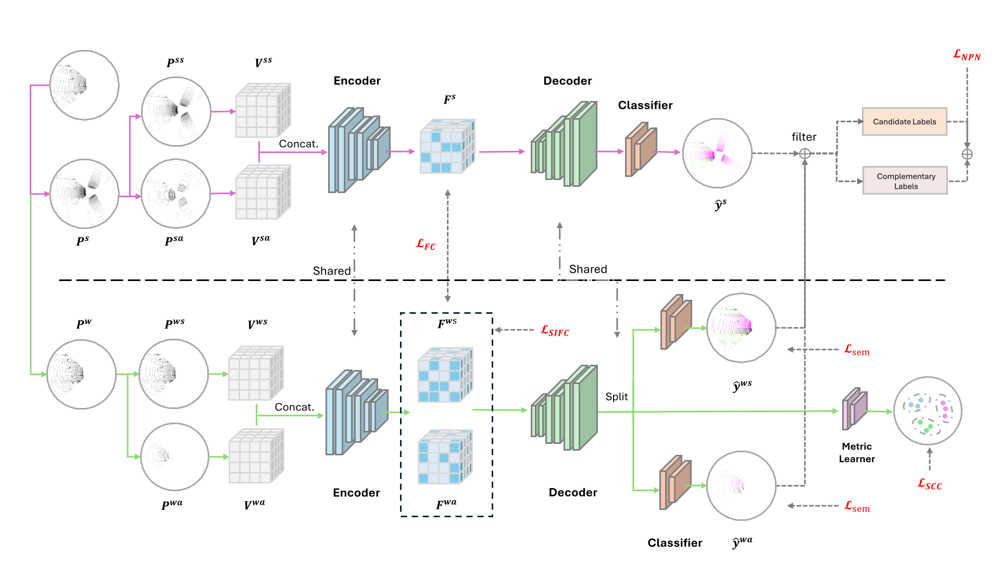

# DGLSS-NL

<div align="center">

**Official PyTorch implementation of _Exploring Single Domain Generalization of LiDAR-based Semantic Segmentation under Imperfect Labels_**

[](https://arxiv.org/abs/2510.09035)
[](https://arxiv.org/pdf/2510.09035)
[](https://doi.org/10.48550/arXiv.2510.09035)


Weitong Kong<sup>*</sup>, Zichao Zeng<sup>*</sup>, Di Wen, Jiale Wei, Kunyu Peng, June Moh Goo, Jan Boehm, Rainer Stiefelhagen

<sup>*</sup>Equal contribution. Authors are listed in alphabetical order.

</div>

DGLSS-NL introduces **Domain Generalization for LiDAR Semantic Segmentation under Noisy Labels**, a benchmark setting for evaluating how 3D semantic segmentation models generalize from one labeled LiDAR domain to unseen domains when the source annotations are imperfect.

The repository provides the implementation of **DuNe**, a dual-view framework designed for robust LiDAR segmentation under label noise and domain shift. DuNe combines strong/weak branches, feature-level consistency, and confidence-aware filtering to improve generalization across SemanticKITTI, nuScenes-lidarseg, Waymo, and SemanticPOSS.

<p align="center">
  
</p>

## Paper

**Exploring Single Domain Generalization of LiDAR-based Semantic Segmentation under Imperfect Labels**  
Weitong Kong<sup>*</sup>, Zichao Zeng<sup>*</sup>, Di Wen, Jiale Wei, Kunyu Peng, June Moh Goo, Jan Boehm, Rainer Stiefelhagen

- **arXiv:** [arXiv:2510.09035](https://arxiv.org/abs/2510.09035)
- **PDF:** [Download paper](https://arxiv.org/pdf/2510.09035)
- **DOI:** [10.48550/arXiv.2510.09035](https://doi.org/10.48550/arXiv.2510.09035)
- **Version:** v2, revised March 10, 2026

## Main Results

Under **10% symmetric label noise**, DuNe achieves strong single-source domain generalization across three LiDAR segmentation benchmarks:

| Method | SemanticKITTI mIoU | nuScenes mIoU | SemanticPOSS mIoU | AM | HM |
| --- | ---: | ---: | ---: | ---: | ---: |
| **DuNe (ours)** | **56.86** | **42.28** | **52.58** | **49.57** | **48.50** |

AM and HM denote the Arithmetic Mean and Harmonic Mean across target-domain results, respectively.

## Highlights

- **New task setting:** single-domain generalization for LiDAR semantic segmentation with noisy source labels.
- **Benchmark coverage:** SemanticKITTI, nuScenes-lidarseg, Waymo, and SemanticPOSS.
- **Robust training strategy:** dual-view learning with consistency regularization and confidence-aware prediction filtering.
- **Strong cross-domain results:** under 10% symmetric label noise, DuNe achieves 56.86 mIoU on SemanticKITTI, 42.28 on nuScenes, and 52.58 on SemanticPOSS, with 49.57 AM and 48.50 HM.

## News

- **2025:** Paper released on arXiv: [Exploring Single Domain Generalization of LiDAR-based Semantic Segmentation under Imperfect Labels](https://arxiv.org/abs/2510.09035).

## Method Overview

LiDAR semantic segmentation models are commonly trained in one domain and deployed in another, where sensor setup, scene distribution, and weather can shift substantially. In practice, the source-domain labels can also contain annotation noise caused by occlusion, sparse geometry, sensor artifacts, and human labeling errors.

DGLSS-NL studies this combined challenge. The proposed **DuNe** framework uses two complementary views of the same LiDAR scene:

1. A **weak branch** learns from less aggressively transformed inputs.
2. A **strong branch** receives stronger perturbations to encourage robustness.
3. Feature-level consistency aligns both branches.
4. Confidence-aware filtering reduces the effect of unreliable noisy labels.

## Repository Structure

```text
DGLSS-NL/
|-- configs/              # Dataset, training, and label-mapping configurations
|-- datasets/             # Dataset loaders and augmentation utilities
|-- figs/                 # Figures used in the README and paper materials
|-- models/               # MinkUNet backbone and model modules
|-- pipeline/             # PyTorch Lightning experiment logic
|-- utils/                # Losses, evaluation, logging, visualization, and helpers
|-- main.py               # Training and testing entry point
`-- README.md
```

## Installation

The code has been tested with:

- Python 3.8
- CUDA 11.1
- PyTorch 1.8.0
- PyTorch Lightning 1.6.5
- MinkowskiEngine

Create a conda environment and install the required packages:

```bash
conda create -n dglss-nl python=3.8 -y
conda activate dglss-nl

pip install torch==1.8.0 pytorch-lightning==1.6.5
pip install easydict munch PyYAML scikit-learn numba
```

Install [MinkowskiEngine](https://github.com/NVIDIA/MinkowskiEngine) following the official instructions for your CUDA and PyTorch versions.

## Datasets

This project supports SemanticKITTI, nuScenes-lidarseg, Waymo, and SemanticPOSS. After downloading each dataset, update the corresponding `data_path` and, when needed, `label_path` fields in the config files under `configs/`.

### SemanticKITTI

Download SemanticKITTI from the [official website](http://www.semantic-kitti.org/) and organize it as:

```text
path_to_SemanticKITTI/
`-- sequences/
    |-- 00/
    |   |-- labels/
    |   |   |-- 000000.label
    |   |   `-- ...
    |   |-- velodyne/
    |   |   |-- 000000.bin
    |   |   `-- ...
    |   |-- calib.txt
    |   |-- poses.txt
    |   `-- times.txt
    `-- ...
```

### nuScenes-lidarseg

Download nuScenes-lidarseg from the [official website](https://www.nuscenes.org/nuscenes#overview) and organize it as:

```text
path_to_nuScenes/
|-- lidarseg/
|   `-- v1.0-{mini,test,trainval}/
|       |-- xxxx_lidarseg.bin
|       `-- ...
|-- samples/
|   `-- LIDAR_TOP/
|       |-- xxxx.pcd.bin
|       `-- ...
|-- sweeps/
|-- v1.0-{mini,test,trainval}/
|   |-- *.json
|   `-- ...
`-- nuscenes_infos_{train,val,test}.pkl
```

### Waymo

Download Waymo Open Dataset from the [official website](https://waymo.com/open/data/perception/) and organize it as:

```text
path_to_Waymo/
|-- 0000/
|   |-- labels/
|   |   |-- 000000.label
|   |   `-- ...
|   `-- velodyne/
|       |-- 000000.bin
|       `-- ...
`-- 0999/
```

### SemanticPOSS

Download SemanticPOSS from the [official website](http://www.poss.pku.edu.cn/semanticposs.html) and organize it as:

```text
path_to_POSS/
`-- sequences/
    |-- 00/
    |   |-- labels/
    |   |   |-- 000000.label
    |   |   `-- ...
    |   |-- velodyne/
    |   |   |-- 000000.bin
    |   |   `-- ...
    |   |-- tag/
    |   |   |-- 000000.tag
    |   |   `-- ...
    |   |-- calib.txt
    |   |-- poses.txt
    |   `-- times.txt
    `-- ...
```

## Configuration

Two example config files are provided:

- `configs/config_kitti.yaml`: SemanticKITTI as the source domain.
- `configs/config_waymo.yaml`: Waymo as the source domain.

Before training or testing, edit the config file to match your local dataset paths:

- `dataset_SemKITTI.data_path`
- `dataset_SemKITTI.label_path` for noisy-label experiments
- `dataset_nuScenes.data_path`
- `dataset_Waymo.data_path`
- `dataset_SemPOSS.data_path`
- `train_params.resume_ckpt` if resuming training
- `train_params.pretrained_ckpt_path` if loading pretrained weights
- `test_params.ckpt_path` for evaluation

## Training

Train with a selected source-domain config:

```bash
python main.py \
  --logdir DGLSS_KITTI \
  --config configs/config_kitti.yaml
```

To resume from a checkpoint, set `train_params.resume_ckpt` in the config and run:

```bash
python main.py \
  --logdir DGLSS_KITTI_RESUME \
  --config configs/config_kitti.yaml \
  --resume
```

If your noisy labels are stored separately, you can override the label path from the command line:

```bash
python main.py \
  --logdir DGLSS_KITTI_NOISY \
  --config configs/config_kitti.yaml \
  --label_path /path/to/noisy/labels
```

## Evaluation

Set `test_params.ckpt_path` in the config, then run:

```bash
python main.py \
  --logdir DGLSS_TEST \
  --test \
  --config configs/config_kitti.yaml
```

Evaluation logs are written to `test_logs/`.

## Citation

If you find this project useful, please cite:

```bibtex
@misc{kong2025exploringsingledomaingeneralization,
  title={Exploring Single Domain Generalization of LiDAR-based Semantic Segmentation under Imperfect Labels},
  author={Weitong Kong and Zichao Zeng and Di Wen and Jiale Wei and Kunyu Peng and June Moh Goo and Jan Boehm and Rainer Stiefelhagen},
  year={2025},
  eprint={2510.09035},
  archivePrefix={arXiv},
  primaryClass={cs.CV},
  url={https://arxiv.org/abs/2510.09035}
}
```

## Acknowledgements

This repository builds on the PyTorch, PyTorch Lightning, and MinkowskiEngine ecosystems. We thank the maintainers of SemanticKITTI, nuScenes, Waymo Open Dataset, and SemanticPOSS for making large-scale LiDAR benchmarks publicly available.
